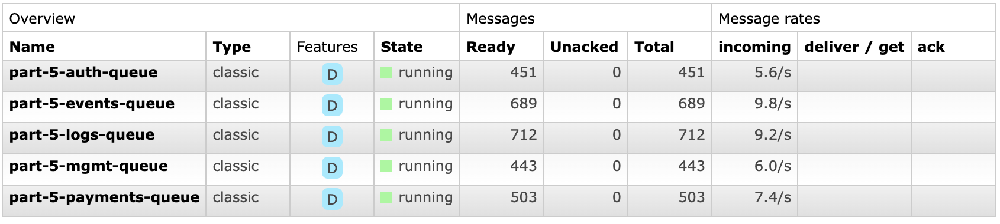

# rabbit-hole
Workspace for learning by experimenting with RabbitMQ messaging broker.

I'm following tutorials from [official RabbitMQ web page](https://www.rabbitmq.com/tutorials/tutorial-one-spring-amqp.html).

## Setup
Decided to use RabbitMQ server started in Docker container.
To follow my setup please install Docker client locally and run:

`docker run -d --hostname host-1 --name rabbit-1 -p 127.0.0.1:5672:5672 -p 127.0.0.1:15672:15672 rabbitmq:3-management`

This will download and run public RabbitMQ Docker image.

To reach RabbitMQ server which is run inside container, used `127.0.0.1:5672` address.

Besides `rabbit-server` (exposed on `5672` port) this specific Docker image brings also a management plugin installed and enabled by default.

To access it, simply enter `127.0.0.1:15672` in your browser and use default `guest/guest` credentials.

## :warning: Before you start :warning:

Before you start running programs related to below Parts, please make sure that your RabbitMQ instance queues are empty and does not contain any old data.

You can clean queue by going to management panel, then to section *Queues*, entering proper *queueName* and then at the bottom you have *Purge* sections where you can clear the queue from persisted messages.

## Part 1 solution - HelloWorld

When I created `Queue` bean then my RabbitMQ management panel displayed this queue and recognized it as legit Rabbit queue.

When I skipped `Queue` bean creation and used raw `template.convertAndSend(queueName, message)` method then RabbitMQ dashboard displayed incoming traffic but the traffic was like 'unrecognized' and not displayed in created queue statistics.

For each connection to Rabbit's exchange or from Rabbit's queue there is a `channel` created.
It is virtual connection from outside of Rabbit to its queues/exchanges/topics.

## Part 2 solution - Dispatching

By default RabbitMQ uses **round-robin** technique of distributing load. It means every new message will be sent to the next receiver in order.
This will cause every receiver will handle the same number od messages (no matter of messages load).

However, Spring AMQP uses **fair dispatching** technique by default.
That means, on message dispatch moment, framework will check the number of messages waiting for being processed by each receiver (*unACKed messages*) and will dispatch a message to the receiver with the lowest number of such *unACKed messages*.
This will cause that receivers will be loaded equally, depending on the amount of work which need to be spent to handle messages. 

In Part 2 solution we created:
* 1 sender (which sends messages in following manner):
  * first message will need 1 second of processing
  * second message will need 4 seconds of processing
  * third message will need 7 seconds of processing
  * and then cycles repeats...
* 1 queue
* 3 receivers

### Fact 1
RabbitMQ has `DEFAULT_PREFETCH_SIZE` property set to **20**. This property sets a maximum number of messages that can be assigned to receiver. 
After reaching this limit, messages won't be dispatching any new messages to this receiver until it get unloaded.
Spring AMQP uses value **250**.

### Fact 2

In pure Java Rabbit MQ client (and others languages also) you always have to handle sending ACK or rejecting messages manually.
In Spring AMQP it is handled by framework, under the hood.

## Part 3 solution - Exchanges

:warning: **Senders never should send messages directly to the queues** :warning:

Sender should send it to exchanges and these should decide about sending (or not) messages forward.

Exchanges can have different types: 
- `direct` - messages routed by *routing key* (adres docelowych kolejek)
- `topic` - messages routed based on wildard matching between routin key and queues binding routing pattern
- `headers` - uses argument with headers to route messages
- `fanout` - duplicates messages and routes to every connected queue

**AnonymousQueue** - by creating `new AnonymousQueue()` we have a randomly-named queue created. It also creates a new, empty queue every time we start an applicaiton and deletes itself (and hence messages also) after stopping the app.

Anonymous queues names are generated and look like this `spring.gen-zfbuvu8MSW-fPjkiLmj_cg`.

If we don't bind any queue to an existing exchange, then the messages incoming to the exchange will be lost and deleted (as no consumer is listening).

To send a message to the exchange we need to use `.convertAndSend(exchangeName, routingKey, message)` method. But as for fanout exchanges the routing key doesn't matter then we can use dummy empty string for 2nd param.

:warning: To observe this solution fully, you have to monitor your exchange and queues LIVE, during program being started and traffic generated. After program stop, queues are deleted and messages purged. :warning:

## Part 4 solution - Routing

Nothing special learned in this section. Routing logic is very simple. Comparing to previous solution:
- changed FanoutExchange to DirectExchange
- added routing key to every message sent
- enhanced bindings with routing key info

## Part 5 solution - Topics

Previous solution has rather limited routing possibilities - it allows only to route base on single criteria (exact routing_key match).

To enable routing based on multiple criteria **topics** has been introduced. 
Messages sent to a topic exchange can't have an arbitrary routing_key - it must be a list of words, delimited by dots. 
The words can be anything, but usually they specify some features connected to the message. There can be as many words in the routing key as you like, up to the limit of 255 bytes.

Bindings works similar but matching is done with additional handling of `wildcards`:
- `*` (star) can substitute for exactly one word.
- `#` (hash) can substitute for zero or more words.

Specific cases are bindings which are configured with no special characters `*`/`#` (then it behaves as direct exchange) or bindings with only `#` (then it behaves like fanout exchange).

When the message does not match to any of binding keys (e.g. routing key has 4 words instead of 3) then it is lost.

****

In this solution we emit a random message every 100 milliseconds which routing key consist of message type (log/event), area (payments/mgmt/auth) and random identifier.

Here we can see queues stats after leaving the emitter program to work:

...and also exchange stats:

Topic statistics show doubled frequency of message processing due to stats view not being refreshed constantly but with some delay.
Stats show `0.0/s` and in the next cycle `19/s` (which is doubled frequency value).

## Part 6 solution - callbacks, RPC

To implement RPC model, we can simply use `convertSendAndReceive` method of `RabbitTemplate` instead previously used `convertAndSend`.

In pure RabbitMQ, on the client side, we have to specify a `callbackQueue` (a queue where the response will be sent to) and also a `correlationId` (identifier to match a received response to request sent). 
Here, in this solution, SpringAMQP library handles both these aspects for us so we don't have to bother with correlationId matching and callbackQueue.
SpringAMQP handles also situations where RPC server dies after returning result but before sending ACK. After server restart, when proper ACK will be sent, SpringAMQP will match it to the correct request.

****

In this solution we create a `FunctionInputSender` which will randomly generate a number from 0-9 range and one of three functions (sqrt/log/fib).

Then it sends a message to a direct exchange which has 3 bindings to queues delegated to calculate a reuslt for each of those functions (Square Root, Logarithm and Fibonacci Value).

In the end the result is sent back to the sender, and the calculation result is printed to the console.

## Appendix - publish confirms

Making sure published messages made it to the broker can be essential in some applications. `Publisher confirms` are a RabbitMQ feature that helps to meet this requirement. 

Publisher confirms are asynchronous in nature but it is also possible to handle them synchronously. There is no definitive way to implement publisher confirms, this usually comes down to the constraints in the application and in the overall system.
Typical techniques are:

- publishing messages individually, waiting for the confirmation synchronously: simple, but very limited throughput.
- publishing messages in batch, waiting for the confirmation synchronously for a batch: simple, reasonable throughput, but hard to reason about when something goes wrong.
- asynchronous handling: best performance and use of resources, good control in case of error, but can be involved to implement correctly (requires sequential number tracking, sequential number matching and 2 callbacks definitions: for confirmed message and for NACK-ed message)